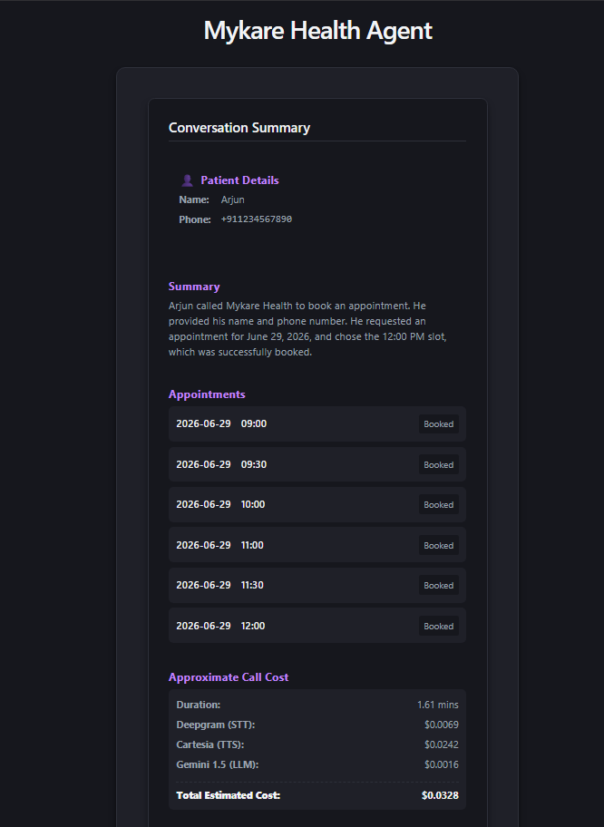

# Mykare Voice AI Agent

**Live Demo:** [https://voice-agent-lemon-beta.vercel.app/](https://voice-agent-lemon-beta.vercel.app/)

This is a real-time conversational AI voice agent built for healthcare reception tasks. 

It allows users to speak directly with an AI, handles back-and-forth exchanges, manages appointments (via Postgres), and presents a seamless web UI with a synchronized voice avatar.


## 🚀 Features
- **Real-Time Voice AI**: Deepgram for STT, Cartesia for TTS, and Google Gemini 2.5 Flash for the LLM.
- **Smart Tool Calling**: Automatically fetches available slots, books appointments, and retrieves user booking history via voice.
- **Visual Call UI**: Integrates **Tavus** for full-body conversational video avatars (`VideoCallAvatar`), automatically falling back to a speech-synced animated orb if video is disabled.
- **Conversation Summary**: Automatically generates a structured post-call summary using the LLM when the conversation ends.
- **Persistent DB**: PostgreSQL tracks users, appointments, and call history.

## 🏗️ Architecture
- **Backend (Python)**: Uses `LiveKit Agents` framework. Handles WebRTC connections, STT/TTS routing, and DB operations.
- **Frontend (React / Vite)**: Connects to the LiveKit room via `@livekit/components-react`. Displays tool invocations and live status.


## 💻 Local Setup Instructions

### 1. Environment Variables
Rename `.env.example` to `.env` in the root folder and add your keys:
- `LIVEKIT_URL`, `LIVEKIT_API_KEY`, `LIVEKIT_API_SECRET`: [LiveKit Cloud](https://cloud.livekit.io/)
- `GEMINI_API_KEY`: [Google AI Studio](https://aistudio.google.com/)
- `DEEPGRAM_API_KEY`: [Deepgram Console](https://console.deepgram.com/)
- `CARTESIA_API_KEY`: [Cartesia Dashboard](https://play.cartesia.ai/)
- `TAVUS_API_KEY`, `TAVUS_REPLICA_ID`, `TAVUS_PERSONA_ID`: [Tavus Platform](https://platform.tavus.io/) (Optional, for avatar video integration)

### 2. Backend Setup
Requires Python 3.9+
```bash
python -m venv venv
source venv/bin/activate  # On Windows: venv\Scripts\activate
pip install -r requirements.txt

# Run the backend agent
python backend/voice_agent.py dev
```

### 3. Frontend Setup
Requires Node.js 18+
```bash
cd frontend
npm install
npm run dev
```
Then navigate to `http://localhost:5173`.

---

## ☁️ Free deployment

The production services are intentionally separated because a LiveKit agent is a
persistent worker, while FastAPI is a normal HTTP service:

| Service | Free host | Repository entrypoint |
| --- | --- | --- |
| Custom React frontend | Vercel | `frontend/` |
| Token and summary API | Render | `Dockerfile.api` |
| Voice agent worker | LiveKit Cloud | `Dockerfile` |
| PostgreSQL | Neon | External `DATABASE_URL` |

### 1. Create the database

1. Create a free Neon project and copy its PostgreSQL connection string.
2. Keep the connection string private. It becomes `DATABASE_URL` on both Render
   and LiveKit Cloud so the API and agent share the same data.

The application creates its tables automatically on startup.

### 2. Deploy the voice worker to LiveKit Cloud

Install the current LiveKit CLI on Windows:

```powershell
winget install LiveKit.LiveKitCLI
```

Authenticate, select your existing LiveKit project, and create the agent in the
nearest available region:

```powershell
lk cloud auth
lk project list
lk project set-default "YOUR_PROJECT_NAME"
lk agent create --region ap-south --secrets DATABASE_URL="YOUR_NEON_CONNECTION_STRING" --secrets GEMINI_API_KEY="YOUR_GEMINI_KEY" .
```

LiveKit Cloud injects `LIVEKIT_URL`, `LIVEKIT_API_KEY`, and
`LIVEKIT_API_SECRET` into the worker automatically. Do not add them to the
worker image. Check the deployment with:

```powershell
lk agent status
lk agent logs
```

Future worker deployments use `lk agent deploy` from the repository root.

### 3. Deploy FastAPI to Render

1. Push this branch to GitHub.
2. In Render, select **New → Blueprint** and connect the repository.
3. Render reads `render.yaml` and creates the free `mykare-api` web service.
4. Enter these secret values when prompted:
   - `DATABASE_URL`: the same Neon connection string.
   - `LIVEKIT_URL`: the WebSocket URL from your LiveKit project.
   - `LIVEKIT_API_KEY`: the LiveKit project API key.
   - `LIVEKIT_API_SECRET`: the LiveKit project API secret.
   - `TAVUS_API_KEY`, `TAVUS_REPLICA_ID`, `TAVUS_PERSONA_ID` (optional): key, replica ID, and persona ID to enable Tavus video replica.
5. After deployment, verify `https://YOUR_RENDER_HOST/health` returns
   `{"status":"ok"}`.

Render's free service sleeps after 15 minutes without inbound traffic. The
frontend already calls `/ping` before requesting `/token`, but the first call
after sleeping can take about one minute.

### 4. Connect the Vercel frontend

Keep the Vercel project's Root Directory set to `frontend`. Add this production
environment variable and redeploy:

```text
VITE_API_URL=https://YOUR_RENDER_HOST
```

The custom frontend remains entirely on Vercel. It requests a room token from
Render, then connects directly to LiveKit, which dispatches the deployed agent.


## 🎥 Demo

[view the full demo video](https://youtu.be/UN6qSFHkoJo)


### 1. Welcome & Initial Screen


### 2. Post-Call Summary Panel

